# 🧠 MindCare AI

<p align="center">

# 🌐 Live Demo

🚀 **Try the application online:**

**https://project-pbel-30-mentalhealth.streamlit.app/Home**


# AI-Powered Mental Health Assessment & Prediction System

A modern Machine Learning powered web application built with **Python**, **Streamlit**, and **Scikit-learn** for mental health assessment, prediction, analytics, and personalized recommendations.

</p>

---

## 📖 Overview

MindCare AI is an intelligent mental health assessment platform that predicts mental health conditions using Machine Learning.

The application enables users to:

- Complete an interactive assessment
- Predict mental health status
- View confidence score
- Receive personalized recommendations
- Download professional PDF reports
- Track assessment history
- View dashboard analytics
- Monitor wellness score

---

# ✨ Features

- 🏠 Beautiful Modern Home Page
- 🔐 Login & Signup Authentication
- 📝 Mental Health Assessment
- 🤖 Machine Learning Prediction
- 📊 Confidence Score
- ❤️ Wellness Score
- 📈 Interactive Dashboard
- 📄 PDF Report Generation
- 📂 Assessment History
- 📤 CSV Export
- 🎨 Responsive Streamlit UI

---

# 🛠️ Tech Stack

| Technology | Purpose |
|------------|----------|
| Python | Backend |
| Streamlit | Web Framework |
| Scikit-learn | Machine Learning |
| Pandas | Data Processing |
| NumPy | Numerical Computing |
| Plotly | Data Visualization |
| SQLite | Authentication |
| ReportLab | PDF Reports |

---

# 📷 Application Screenshots

## 🏠 Home Page

<p align="center">
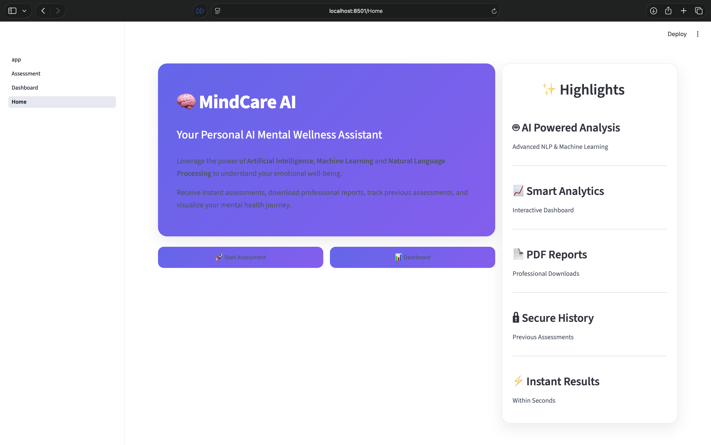
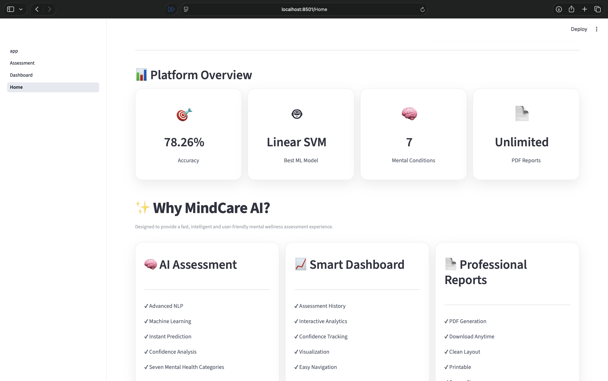
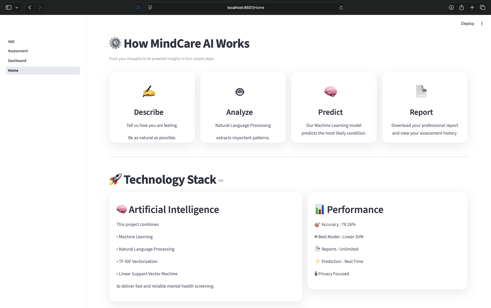
</p>

---

## 📝 Assessment

<p align="center">
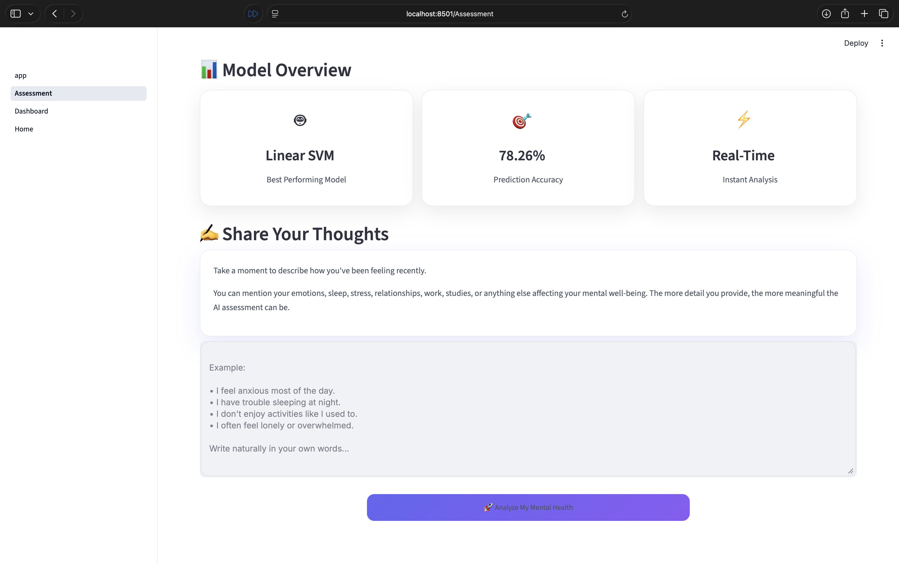
</p>

---

## 📊 Dashboard

<p align="center">
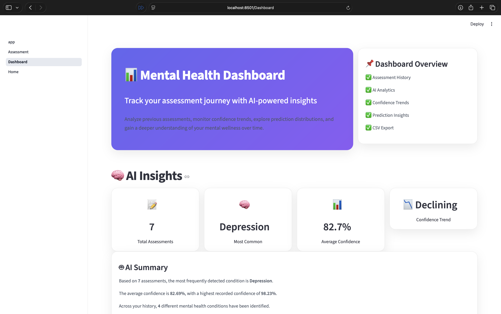
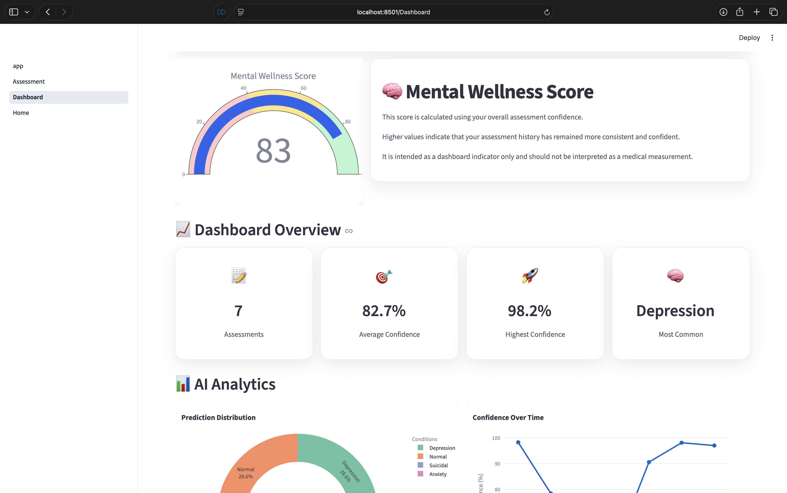
</p>

<p align="center">
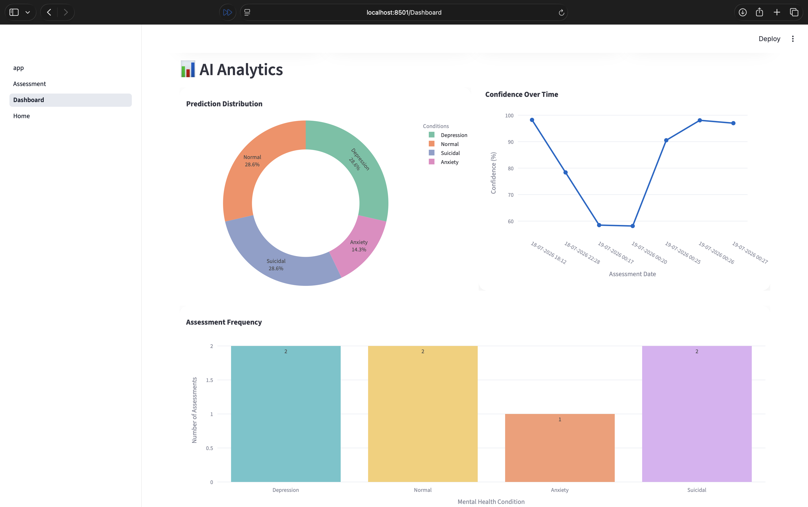
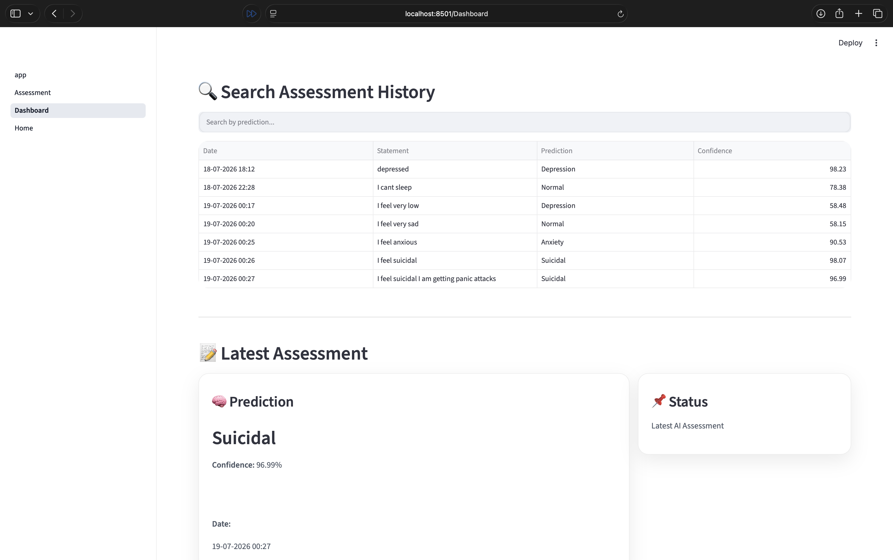
</p>

<p align="center">
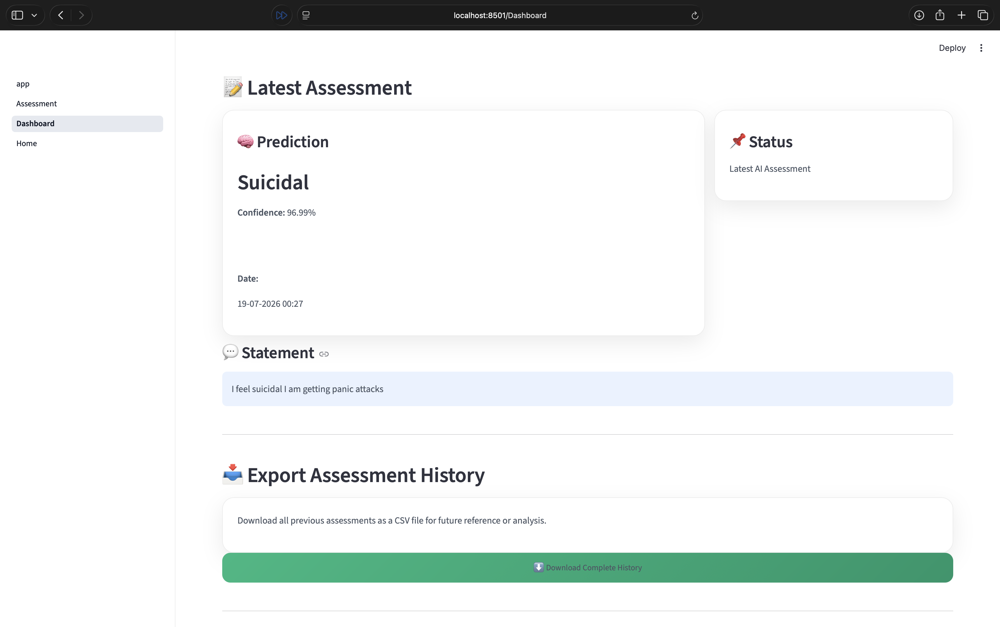
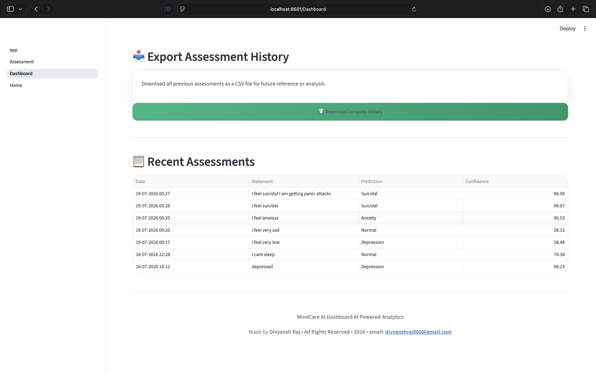
</p>

---

## 📄 Generated PDF Report

<p align="center">
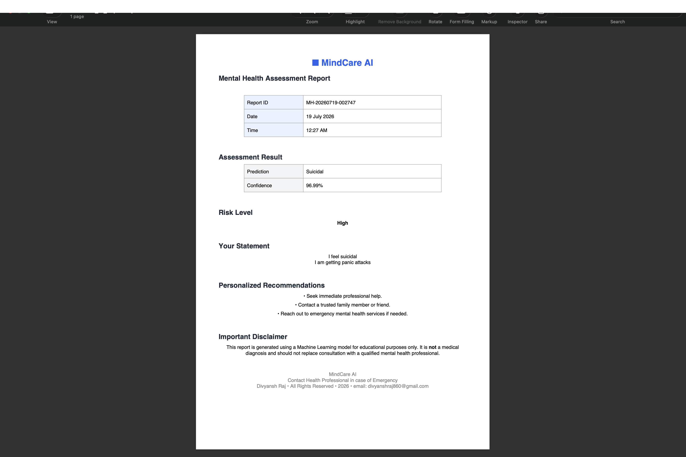
</p>

---

# 📂 Project Structure

```text
MindCare-AI
│
├── assets/
│   └── css/
│
├── auth/
│
├── components/
│
├── data/
│
├── images/
│
├── models/
│
├── pages/
│
├── utils/
│
├── app.py
├── requirements.txt
├── train_model.py
└── README.md
```

---

# 🚀 Installation

Clone the repository

```bash
git clone https://github.com/divyanshraj860-collab/Project-PBEL-3.0.git
```

Go into the project

```bash
cd Project-PBEL-3.0
```

Create Virtual Environment

### Windows

```bash
python -m venv venv
venv\Scripts\activate
```

### macOS/Linux

```bash
python3 -m venv venv
source venv/bin/activate
```

Install dependencies

```bash
pip install -r requirements.txt
```

Run the application

```bash
streamlit run app.py
```

---

# 🧠 Machine Learning Workflow

```text
Dataset
      │
      ▼
Data Preprocessing
      │
      ▼
Model Training
      │
      ▼
Saved Model (.pkl)
      │
      ▼
User Assessment
      │
      ▼
Prediction
      │
      ▼
Dashboard
      │
      ▼
PDF Report
```

---

# 📁 Dataset

Dataset Used

```
Combined Data.csv
```

Located inside

```
data/
```

---

# 📦 Requirements

Install all required packages

```bash
pip install -r requirements.txt
```

---

# 👨‍💻 Author

**Divyansh Raj**

GitHub:

https://github.com/divyanshraj860-collab

---

# 📜 License

Developed for educational purposes under **PBEL 3.0**.

---

## ⭐ Support

If you like this project, consider giving it a ⭐ on GitHub.